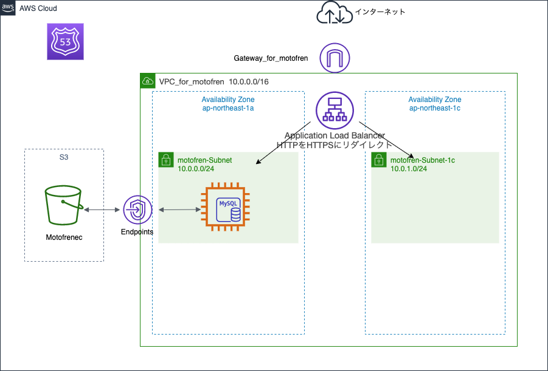

# MotoFren

https://www.motofren.xyz

## サービス概要
バイク好きな人のための、募集投稿型SNSアプリです。  
募集を作成し、そのルーム上で他のユーザーとやりとりができます。プロフィールには好きな画像の投稿も可能です。  

## サービスへの思い
コロナウイルスの影響で観光経済は衰退してしまいましたが、いずれは経済復旧に向けて人々も外に出向くと信じております。  
MotoFrenは郊外への人々の消費に一躍買ってくれるようにと制作しました。2020年6月現在、ツーリングチームの紹介サイトなどは目立ちますが、
誰かとバイクで出かけるのに、わざわざツーリングチームに所属する必要はあるのでしょうか。もっと気軽に、例えばライダースーツなどではなく、
気軽な服装で(それなりに安全な)、誰かとバイクで少し郊外のランチに行く。そんな感じでも良いと思うのです。
そうして外に出向くきっかけが増えれば、郊外まで経済が潤滑してくれるのではないか。そう考え制作しました。

## 設計思想
出来るだけDB設計のアンチパターンを避けること、またモデリングに時間をかけ、冗長なコードを記述しないように心掛けました。
ビューは現場でも使われるslimで書いています。
またherokuではサイトが重かったため、AWSを利用しております。
> トークルームは当初ActionCableによるチャット機能で実装しておりましたが、EC2上での設定が上手くいかず、急遽MVCでの
> 実装に切り替えました。

## 使用技術
### ●環境
Rails: 5.2.4.2　Ruby: 2.5.1　MySQL: 8.0.19

### ●インフラ
AWS：EC2、ELB、MySQL、S3、VPC、Route53、Elastic IP、ACM  
アプリケーションサーバー：Unicorn  
Webサーバー：Nginx

### ●AWS構成

### ●ER図

### ●アプリケーションの機能
- サインアップ・ログイン（Devise）
- SNSログイン機能（Devise、omniauth-facebook、omniauth-twitter、omniauth-google-oauth2）
- 画像投稿機能
- 画像投稿へのコメント機能
- 画像投稿へのいいね！機能
- フォロー・アンフォロー機能
- 募集投稿機能
- 募集投稿へのいいね！機能
- 募集トークルーム内でのメッセージ機能（ActionCable→MVCでの実装に変更）
- 募集、メッセージ検索機能(ransack)
### ●その他の技術
- Rspecでテストを記述
- ビューはslimで記述
- 静的解析ツール（rubocop）の使用
- bulletでN+1クエリを回避
- kaminariとinfinite-scrollで無限スクロール
- AWS ACMでSSL証明書を発行し、SSL化
●今後実装する機能
- EC2インスタンス上でチャット機能が動作するよう修正予定。
